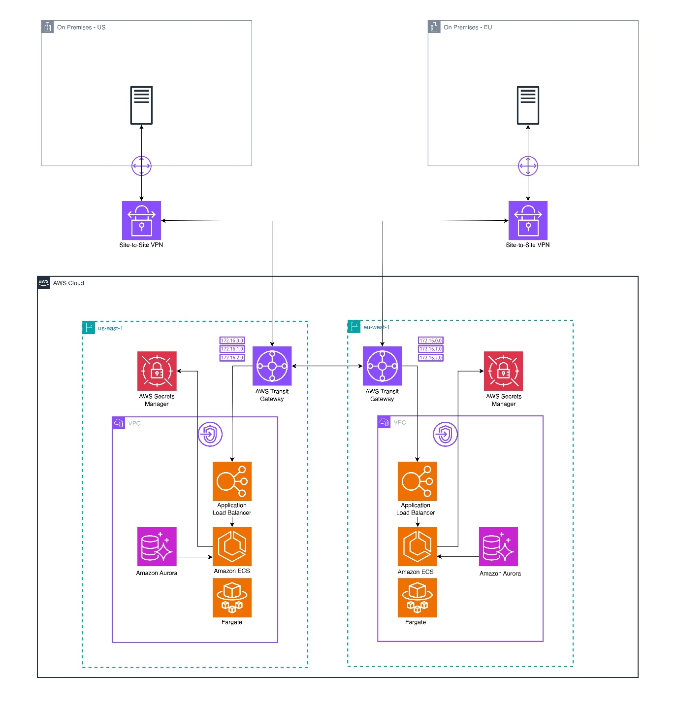

# Customer Management Application on AWS

## Core Idea
 Based on a
healthcare system scenario, this AWS architecture shows how to connect
and use the application in the cloud.

The healthcare company stores customer information in an Aurora Global
Database. A sample database named
\"[db_health.sql](https://github.com/aren-01/Customer-Management-Cloud-Application/blob/main/db/db_health.sql)"
is in the database folder. A JS admin panel application, deployed and
containerized with Docker on the local machine, retrieves data from the
database and updates it. As per the requirements of this scenario, for
availability and low latency, there are two regions, and these regions
are connected to the on-premises servers by a Site-to-Site VPN. In this
way, the company can track its customer information in the AWS Cloud.
Thanks to Aurora Global Database, the data is replicated across regions.
Credentials are stored in AWS Secrets Manager. In case of failure in one
region, the on-premises server can connect to another region via AWS
Transit Gateway.

## Actual Deployment for This Version

In this project, I focused on the system shown above. This is a
simplified version of the first architecture, and it includes an
Internet Gateway (IGW). In practice, it is not safe to deploy a JS
admin panel without a login page; however, this simplified deployment is
only for training purposes using the AWS Free Tier. There is one
temporary EC2 instance, used only to import the SQL file into RDS.

I also deployed a GitHub [destroy.yml](.github/workflows/destroy.yml) file to totally destroy the system with terraform state S3 Bucket. The deploy workflow creates an S3 bucket to store the Terraform state.

[deploy.yml](.github/workflows/deploy.yml):

1. Creates a S3 Bucket to store Terraform state 
2. Creates an ECR repo
3. Containerizes the application through Docker
4. Pushes the container
5. Installs the infrastructure above through Terraform
6. Installs the DB into the RDS instance with a temporary EC2 instance

Please see the [cloudformation.yml](optional/cloudformation.yml) file if you prefer manual deployment of the VPC infrastructure.

You need to configure the GitHub permissions using the least privilege principle when setting up your integration on AWS.
Always follow the principle of least privilege to authorize GitHub.

## How to Deploy It?

This system can work on AWS Free Tier accounts. 

1. Fork the repo
2. Authorize a GitHub role on AWS following the least privilege princible for the services used in this system.
3. Create repository secrets as follows, use the strings provided by AWS for AWS_ROLE_TO_ASSUME:

`AWS_ROLE_TO_ASSUME`

`CLOUDFRONT_SECRET`

`DB_PASSWORD`

`SESSION_SECRET`

4. Start the deployment in the actions tab.
5. After deployment, manually create a Congito user to log into the system through CloudFront.
6. In case you prefer to remove the entire system, in the actions tab, use `Destroy the all deployment`

