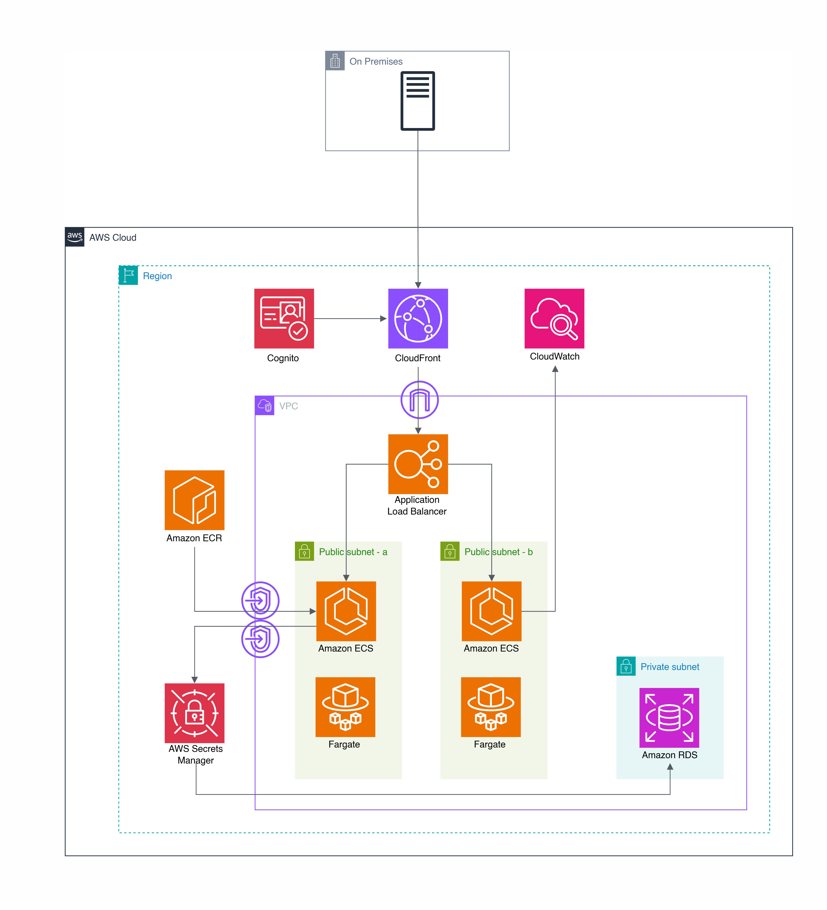

# Customer Management Application on AWS

## Original Idea
 Based on a
healthcare system scenario, this AWS architecture shows how to connect
and use the application in the cloud.

The healthcare company stores customer information in an Aurora Global
Database. A sample database named
\"[db_health.sql](https://github.com/aren-01/Customer-Management-Cloud-Application/blob/main/db/db_health.sql)"
is in the database folder. A JS admin panel application, deployed and
containerized with Docker on the local machine, retrieves data from the
database and edits it. As per the requirements of this scenario, for
availability and low latency, there are two regions, and these regions
are connected to the on-premises servers by a Site-to-Site VPN. In this
way, the company can track its customer information in the AWS Cloud.
Thanks to Aurora Global Database, the data is replicated across regions.
Credentials are stored in AWS Secrets Manager. In case of failure in one
region, the on-premises server can connect to another region via AWS
Transit Gateway.

In this project, I focused on the system shown above. This is a
simplified version of the first architecture, and it includes an
Internet Gateway (IGW). In practice, it is not safe to deploy a JS
admin panel without a login page; however, this simplified deployment is
only for training purposes using the AWS Free Tier. There is one
temporary EC2 instance, used only to import the SQL file into RDS.

I also deployed a GitHub [destroy.yml](.github/workflows/destroy.yml) file to destroy the system. The deploy workflow creates an S3 bucket to store the Terraform state.

## Quick Deployment

[deploy.yml](.github/workflows/deploy.yml):

Creates a S3 Bucket to store Terraform state 
Creates an ECR repo
Containerizes the application through Docker
Pushes the container
Installs the infrastructure above through Terraform
Installs the DB into the RDS instance with a temporary EC2 instance

Please see the [cloudformation.yml](optional/cloudformation.yml) file to manually deploy the VPC infrastructure.

