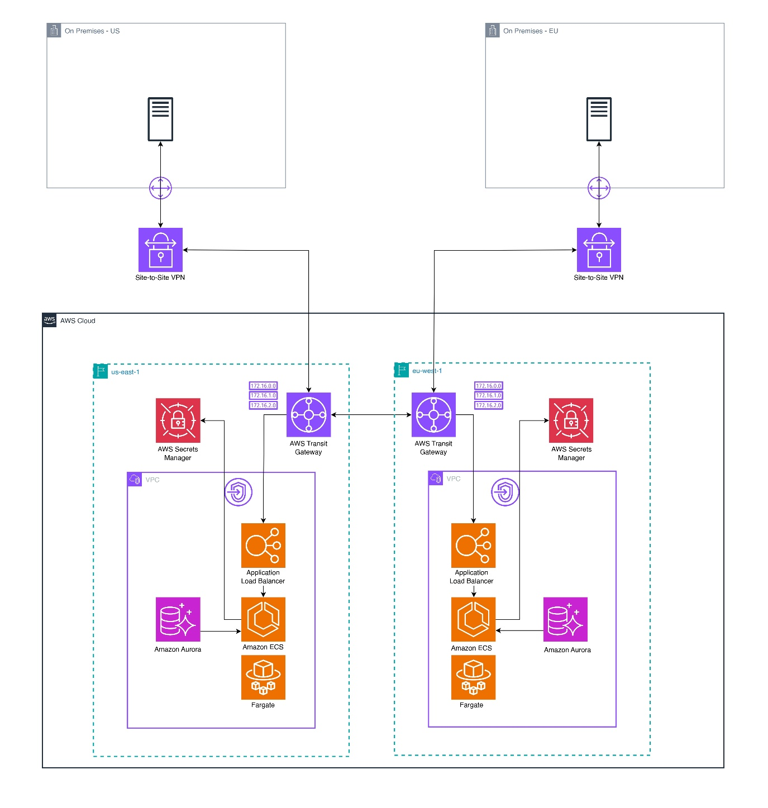
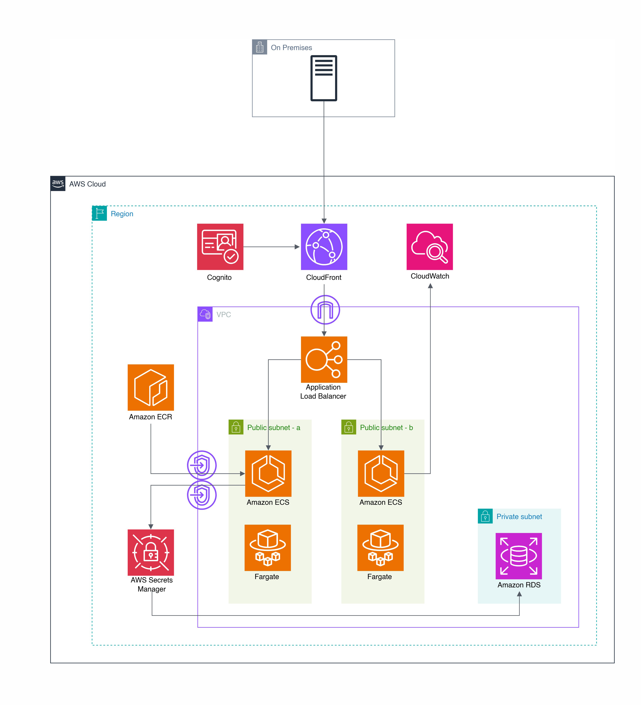
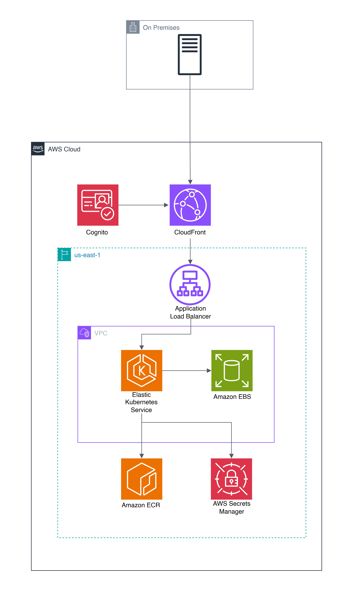
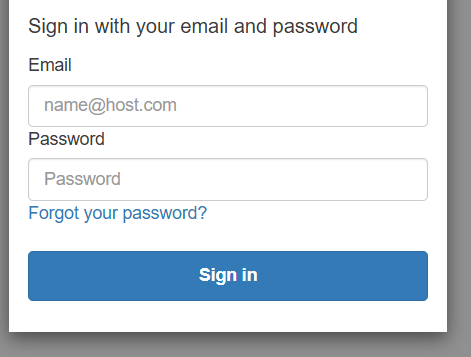
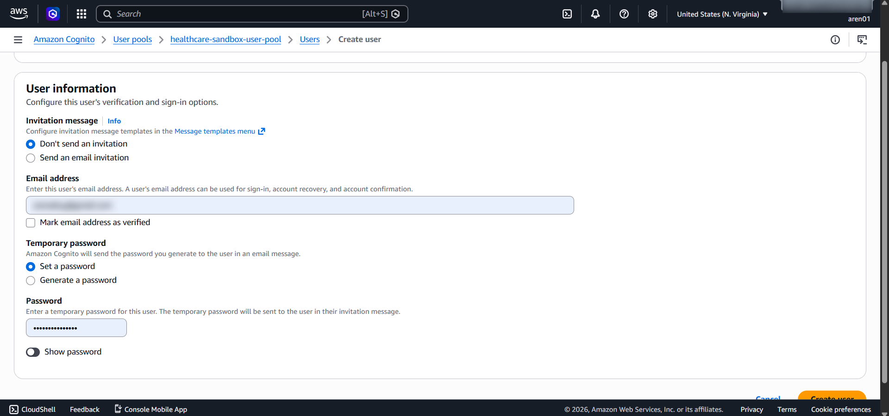
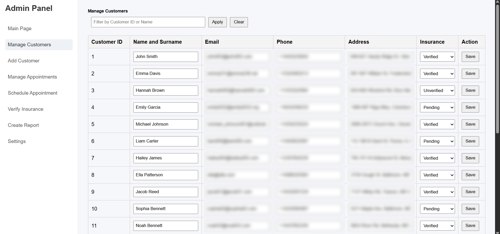
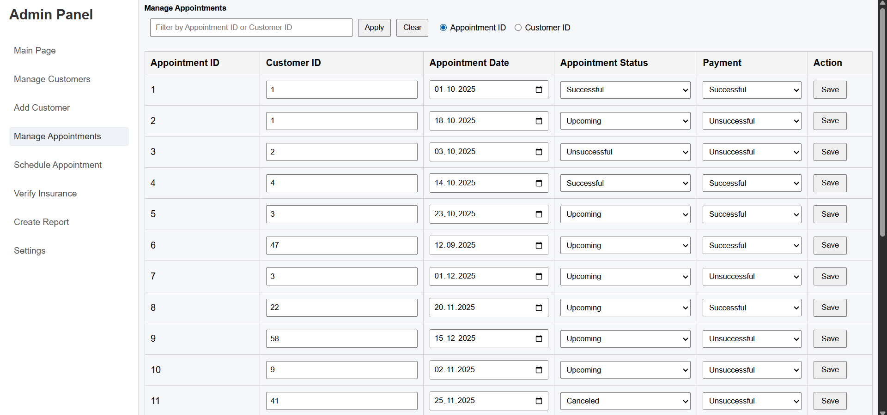
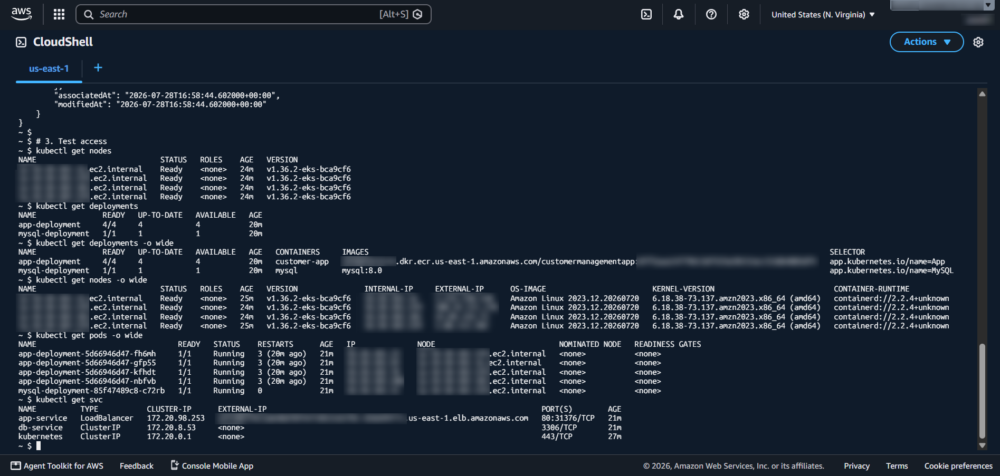

# Customer Management Application on AWS

## Core Idea
 Based on a
healthcare system scenario, this AWS architecture shows how to connect
and use the application in the cloud.

The healthcare company stores customer information in an Aurora Global
Database. A sample database named
\"[db_health.sql](https://github.com/aren-01/Customer-Management-Cloud-Application/blob/main/db/db_health.sql)"
is in the database folder. A JS admin panel application, deployed and
containerized with Docker on the local machine, retrieves data from the
database and updates it. As per the requirements of this scenario, for
availability and low latency, there are two regions, and these regions
are connected to the on-premises servers by a Site-to-Site VPN. In this
way, the company can track its customer information in the AWS Cloud.
Thanks to Aurora Global Database, the data is replicated across regions.
Credentials are stored in AWS Secrets Manager. In case of failure in one
region, the on-premises server can connect to another region via AWS
Transit Gateway.

## Actual Deployment for ECS Version

## Actual Deployment for EKS Version

In the EKS version, I used a helm chart to automate the system and deployment. I used four EC2 nodes with t3.small configuration and in these four instances four replicas of the app deployment and one mysql deployment are supposed to run. To overcome the session issue among the pods I stored login information in an express MySQL session. Please review the [helm chart folder](helm-chart) for more details.

In this project, I focused on the systems shown above. This is a
simplified version of the first architecture, and it includes an
Internet Gateway (IGW). In practice, I used Cognito user authorization and CloudFront instead of Site-to-Site VPN to deploy the JS app. There is one
temporary EC2 instance in the ECS Version, used only to import the SQL file into RDS.

I also deployed a GitHub files to totally destroy the system with terraform state S3 Bucket. The deploy workflow creates an S3 bucket to store the Terraform state.

[deploy-eks.yml](.github/workflows/deploy-eks.yml) and [deploy-ecs.yml](.github/workflows/deploy-ecs.yml):

1. Create a S3 Bucket to store Terraform state 
2. Create an ECR repo
3. Containerize the application through Docker
4. Push the container
5. Install the infrastructures above through Terraform using ECS or EKS based on your choice
6. Install the DB into the RDS instance with a temporary EC2 instance

Please see the [cloudformation.yml](optional/cloudformation.yml) file if you prefer manual deployment of the VPC infrastructure with ECS. Please note that this automates a deployment for an old version, not the recent version of my project.

You need to configure the GitHub permissions using the least privilege principle when setting up your integration on AWS.
Always follow the principle of least privilege to authorize GitHub. To apply least privilege principles, please review the [least privilege folder](least-privilege) and update resource sections. 

## How to Deploy?

This system can work on AWS Free Tier accounts. 

1. Fork the repo
2. Authorize a GitHub role on AWS following the least privilege princible for the services used in this system. This system is using OpenID Connect for authorization.
3. Create repository secrets as follows, use the strings provided by AWS for AWS_ROLE_TO_ASSUME:

`AWS_ROLE_TO_ASSUME`

`CLOUDFRONT_SECRET`

`DB_PASSWORD`

`SESSION_SECRET`

Please also fill the secrets below instead of DB_PASSWORD, if you deploy the EKS version: 

`DB_USER`

`DB_PASS`

4. Start the deployment in the actions tab.
5. After deployment, manually create a Congito user to log into the system through CloudFront.
6. In case you prefer to remove the entire system, in the actions tab, use `Destroy the all deployment` based on the version you installed.

IMPORTANT NOTE ON CONTAINERS IN PUBLIC SUBNETS: Since ALB domain does not work with ACM to use an SSL certificate and I deploy it on AWS Free Tier without a domain, I used CloudFront and Public ECS tasks in the system to integrate Cognito. Otherwise, even if this is deployed in CloudFront, Cognito receives the url in ALB; therefore it fails. Because of this issue, I used public subnets. In a real production environment keep ECS and EKS tasks in a private subnet with a custom domain.

## Status Badge

## Screenshots

