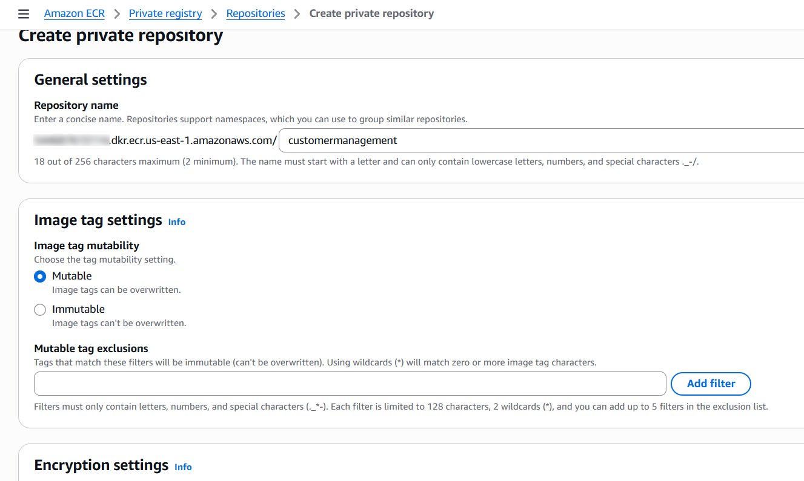
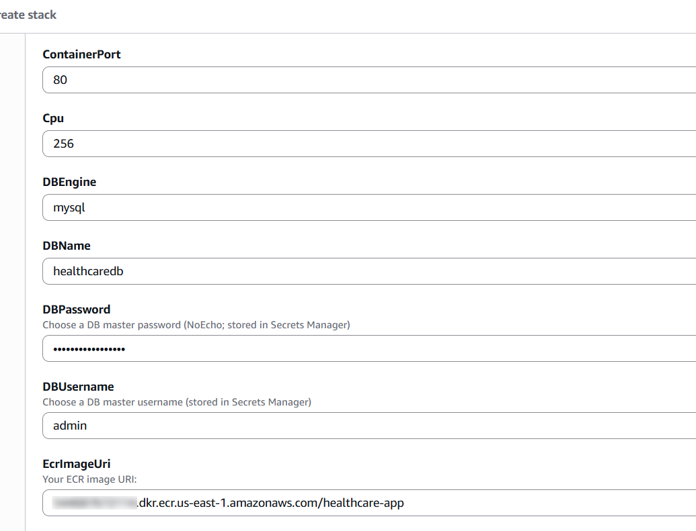

# Follow these steps if you want to manually deploy with [cloudformation.yml](cloudformation.yml).

1.  Pull or download the "app" folder.

2.  Install Docker and deploy the image.

3.  Create an ECR repository. CloudFormation will prompt you for the
    repository URL.



4.  Install and configure the AWS CLI on the local machine.

5.  Authenticate Docker with Amazon ECR.
```bash
aws ecr get-login-password --region us-east-1 |
docker login --username AWS --password-stdin
<ACCOUNT_ID\>.dkr.ecr.us-east-1.amazonaws.com
```
6.  Tag the Docker Image for ECR.
```bash
docker tag healthcare-app:latest
<ACCOUNT_ID\>.dkr.ecr.us-east-1.amazonaws.com/healthcare-app:latest
```
7.  Push the Image to Amazon ECR.
```bash
docker push
<ACCOUNT_ID\>.dkr.ecr.us-east-1.amazonaws.com/healthcare-app:latest
```
8.  Create a CloudFormation stack and upload the
    "[cloudformation.yml](https://github.com/aren-01/Customer-Management-Cloud-Application/blob/main/cloudformation.yml)"
    file as the template.

9.  Fill the parameters as shown in the screenshot below.



10. Start deploying the stack and wait until it finishes. If there is no
    EC2 key pair, create one.

11. This will set up the application. Now pull the
    "[db_health.sql](https://github.com/aren-01/Customer-Management-Cloud-Application/blob/main/db/init.sql)"
    file to import it into the RDS database.

12. In the CloudFormation file, security groups are configured to allow
    the temporary EC2 instance to connect to the RDS instance in the
    private subnet.

13. Connect to the EC2 instance from the local terminal, following the
    instructions in the "Connect" tab.

14. Install MariaDB on the EC2 instance.
```bash
sudo dnf install mariadb105 -y
```
15. Connect to the RDS database
```bash
mysql -h <RDS-ENDPOINT\> -u admin -p
```
16. Create a new database named "healthcaredb"

17. Exit MySQL and the EC2 instance, then upload the "db_health.sql"
    file to the EC2 instance.
```bash
scp -i your-key.pem init.sql
ec2-user@<EC2-PUBLIC-IP\>:/home/ec2-user/
```
18. Import the SQL file into the RDS database.
```bash
mysql -h <RDS-ENDPOINT\> -u admin -p healthcaredb < init.sql
```
19. The application should now be available through the Application Load
    Balancer's HTTP listener. You can access the admin panel to modify
    or add data. To delete the system, simply delete the CloudFormation
    stack.


